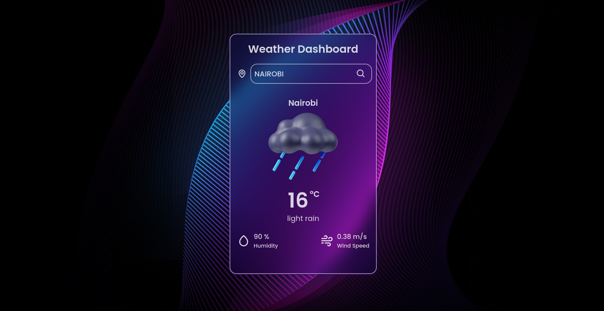

# Weather App 🌤️
A simple and intuitive web application that provides current weather information for any city worldwide. Built using HTML, CSS, and JavaScript, this app fetches real-time weather data from the OpenWeatherMap API and displays it with a clean and responsive design.

   

## Author 

*   Mohamed Hassan Mohamed
*   Majau Phoebe
*   Paula Kyalo
*   Irakoze Ange Taina
*   Alma Mwangi
*   Jeanette Ndunge
*   David Achayo

## Features
🌍 Global City Search: Get weather updates for any city around the globe.
🌡️ Current Weather Conditions: Displays temperature, weather description, humidity, and wind speed.
🌦️ Weather Icons: Shows weather-specific icons for clear, cloudy, rainy, snowy, and other conditions.
🔄 Real-time Updates: Fetches the latest weather data from the OpenWeatherMap API.
🎨 Responsive Design: Optimized for both desktop and mobile users.

## Technologies Used

* Git
* HTML and CSS for structure and styling
* JavaScript for dynamic content and API integration
* OpenWeatherMap API for real-time weather data

## Project setup  installation

### Clone the Repository
  
1.  From the repository, click + in the global sidebar and select Clone this repository under Get to Work.
2.  Copy the clone command.

### Clone the Repository Using Terminal

4. Open your terminal and use the following command to clone the repository:

### Navigate to the Project Directory
5.  cd weather-app
   
### Open the Application
6.  Open index.html in your preferred browser to view the application.

7.  From the terminal you use
    '$ git clone <https://github.com/vanmo9/weatherdashboard.git/>'

## Usage
Enter a city name in the input field and click the search button.
The application will display the current weather conditions for the specified city.

## BDD  
 
| BEHAVIOUR | OUTPUT|
|:------------------|:-----------|
| User loads onto the page  |  User Views Weather Dashboard landing page. |
| User enters a city name in the input field and clicks the search button. | The application displays the current weather conditions for the specified city. |

## Contact Information  

* Email (vanmowha@gmail.com)

## License
This project is licensed under the MIT License - see the LICENSE file for details.
